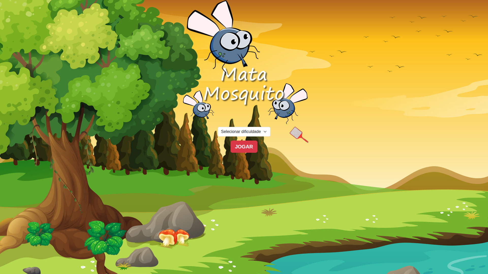

# Mata Mosquito
 
Jogo feito em **HTML, CSS, JavaScript e Bootstrap5**, onde o objetivo é acertar e eliminar os mosquitos sem perder vida enquanto o tempo está rodando. Desenvolvido como projeto de estudo.
 
## Como jogar
 
1. Na tela inicial, selecione o nível de dificuldade:
   - **Normal**
   - **Difícil**
   - **Predador natural**
2. Clique em **JOGAR** para iniciar.
3. Clique nos mosquitos que aparecerem na tela para eliminá-los.
4. Ao final, você é direcionado para a tela de **Vitória** ou **Game over**, dependendo do seu desempenho.
## Demonstração
 

 
## Tecnologias utilizadas
 
- **HTML5**
- **CSS3**
- **JavaScript**
- **Bootstrap5**
## Estrutura do projeto
 
```
Mata_Mosquito/
├── css/                # Estilos do Bootstrap
├── imagens/             # Imagens usadas no jogo
├── index.html            # Tela inicial (seleção de dificuldade)
├── app.html               # Tela principal do jogo
├── vitoria.html            # Tela exibida quando o jogador vence
├── fim_de_jogo.html         # Tela exibida quando o jogador perde
├── meuJs.js                  # Lógica do jogo
└── style.css                  # Estilos personalizados
```
 
## Como executar localmente
 
1. Clone o repositório:
```bash
   git clone https://github.com/PedroLins04/Mata_Mosquito.git
```
2. Acesse a pasta do projeto:
```bash
   cd Mata_Mosquito
```
3. Abra o arquivo `index.html` no seu navegador (basta dar duplo clique ou usar uma extensão como o Live Server no VS Code).

## Autor
 
Desenvolvido por **[Pedro Lins](https://github.com/PedroLins04)**.